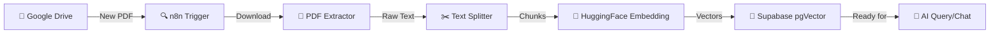

<div dir="rtl" align="right">

# 🤖 سيستم RAG الذكي لمعالجة المستندات تلقائياً | n8n RAG Ingestion Workflow

</div>

<div align="center">

[](https://opensource.org/licenses/MIT)
[](https://n8n.io)
[](https://youtu.be/a2unzl4mNtA)
[](https://github.com/YousefAutomates/n8n-rag-ingestion-workflow/stargazers)
[](http://makeapullrequest.com)
[](https://supabase.com)
[](https://huggingface.co)

<h3>🌍 Available in: 
  <a href="#english">English</a> • 
  <a href="#arabic">العربية</a>
</h3>


### 🎯 Transform Your Documents into Intelligent AI Knowledge Base

*Built with ❤️ by [Yousef Elsherbiny](https://yousefautomates.pages.dev)*

[🚀 Get Started](#quick-start) • [📺 Watch Tutorial](https://youtu.be/a2unzl4mNtA) • [💬 Get Support](https://yousefautomates.pages.dev)

</div>

---

<a name="english"></a>
## 📖 English Documentation

### 🌟 What is This?

**n8n RAG Ingestion Workflow** is a powerful, production-ready automation system that transforms your PDF documents into an AI-searchable knowledge base. Using cutting-edge RAG (Retrieval-Augmented Generation) technology, this workflow automatically:

- 📥 **Monitors** your Google Drive for new documents
- 📄 **Extracts** text from PDFs intelligently
- 🧠 **Converts** content into AI-understandable vector embeddings
- 💾 **Stores** everything in a blazing-fast vector database
- 🔍 **Enables** semantic search and AI-powered Q&A

### 💡 Why Use RAG?

Traditional search relies on keyword matching. **RAG is different:**

| Traditional Search | RAG-Powered Search |
|-------------------|-------------------|
| ❌ Exact keywords only | ✅ Understanding context & meaning |
| ❌ Misses synonyms | ✅ Semantic similarity |
| ❌ No AI reasoning | ✅ AI-generated accurate answers |
| ❌ Static results | ✅ Dynamic, contextual responses |

### 🎯 Perfect For

- 📚 **AI Documentation Systems** - Build intelligent help centers
- 🤖 **Chatbots** - Create context-aware customer support bots
- 🔬 **Research Tools** - Search through academic papers semantically
- 📊 **Business Intelligence** - Query company knowledge bases with AI
- 🏢 **Enterprise Solutions** - Scalable document management
- 🎓 **Educational Platforms** - Interactive learning assistants

### ✨ Key Features

<table>
<tr>
<td width="50%">

#### 🚀 Automation
- ⚡ Real-time file monitoring
- 🔄 Auto-processing pipeline
- 📁 Batch document handling
- ⏱️ Scheduled processing

</td>
<td width="50%">

#### 🧠 Intelligence
- 🤖 Advanced AI embeddings
- 🌍 Multilingual support (100+ languages)
- 📊 Semantic search ready
- 🎯 Context-aware chunking

</td>
</tr>
<tr>
<td width="50%">

#### 🔒 Enterprise-Ready
- 🛡️ Secure credential management
- 📈 Scalable architecture
- 🔧 Easy customization
- 📊 Performance optimized

</td>
<td width="50%">

#### 🎓 Developer-Friendly
- 📖 Extensive documentation
- 🎥 Video tutorials
- 💬 Community support
- 🔓 Open-source (MIT)

</td>
</tr>
</table>

### 🏗️ System Architecture



### 🛠️ Technical Stack

| Component | Technology | Purpose |
|-----------|-----------|---------|
| **Automation Engine** | n8n | Workflow orchestration |
| **File Storage** | Google Drive | Document source |
| **Vector Database** | Supabase + pgvector | Embedding storage |
| **AI Embeddings** | HuggingFace (e5-large) | Text vectorization |
| **Language** | SQL, JSON | Configuration |

### 📋 Prerequisites

Before starting, ensure you have:

- ✅ **n8n Instance** - [Self-hosted](https://docs.n8n.io/hosting/) or [Cloud](https://n8n.io/cloud/)
- ✅ **Google Account** - With Drive API enabled
- ✅ **Supabase Account** - Free tier available
- ✅ **HuggingFace Token** - Free API access
- ✅ **Basic Knowledge** - Familiarity with APIs (optional but helpful)

<a name="quick-start"></a>
### 🚀 Quick Start Guide

#### Step 1: Clone Repository

```bash
git clone https://github.com/YousefAutomates/n8n-rag-ingestion-workflow.git
cd n8n-rag-ingestion-workflow
```

#### Step 2: Setup Supabase Database

1. Create a new Supabase project
2. Go to SQL Editor
3. Copy contents from `setup_rag.sql`
4. Execute the script

```sql
-- This will create:
-- ✅ Vector extension
-- ✅ Documents table
-- ✅ Match function for semantic search
```

#### Step 3: Configure n8n Credentials

<details>
<summary>🔐 Google Drive Setup</summary>

1. Go to n8n → Credentials
2. Add "Google Drive OAuth2"
3. Follow authentication flow
4. Grant required permissions
</details>

<details>
<summary>🔐 Supabase Setup</summary>

1. Get your Supabase URL and Key
2. Add "Supabase" credential in n8n
3. Test connection
</details>

<details>
<summary>🔐 HuggingFace Setup</summary>

1. Get API token from [HuggingFace](https://huggingface.co/settings/tokens)
2. Add "HuggingFace API" credential in n8n
3. Verify access
</details>

#### Step 4: Import Workflow

1. Open n8n
2. Click "Import from File"
3. Select `RAG Ingestion Workflow (Part 1).json`
4. Configure node credentials
5. Update Google Drive folder ID

#### Step 5: Test & Deploy

```bash
# Upload a test PDF to your monitored folder
# Check n8n execution logs
# Verify vectors in Supabase
```

### 📊 Configuration Options

#### Text Chunking Settings

```javascript
{
  "chunkSize": 400,      // Characters per chunk
  "chunkOverlap": 50,    // Overlap for context preservation
  "separator": "

"    // Split on paragraphs
}
```

**Recommended Settings by Use Case:**

| Use Case | Chunk Size | Overlap | Notes |
|----------|-----------|---------|-------|
| **Chatbots** | 300-500 | 50-100 | Balance context & speed |
| **Search** | 200-300 | 30-50 | Precise results |
| **Documentation** | 500-800 | 100-150 | Preserve context |
| **Legal Docs** | 800-1200 | 150-200 | Maximum context |

#### Embedding Model Options

Current: `intfloat/multilingual-e5-large` (1024 dimensions)

Alternatives:
- `sentence-transformers/all-MiniLM-L6-v2` - Faster, English-only
- `intfloat/multilingual-e5-small` - Lighter, 384 dims
- Custom fine-tuned models - Your domain-specific model

### 🎥 Video Tutorial

<div align="center">

[](https://youtu.be/a2unzl4mNtA)

**📺 Complete Walkthrough Available**

[▶️ Watch on YouTube](https://youtu.be/a2unzl4mNtA)

*Learn how to build this system step-by-step (Arabic)*

</div>

### 📚 Documentation

- 📖 [Full Documentation](https://github.com/YousefAutomates/n8n-rag-ingestion-workflow/wiki) *(Coming Soon)*
- 🎓 [Tutorial Blog](https://yousefautomates.pages.dev)
- 💬 [Community Forum](https://github.com/YousefAutomates/n8n-rag-ingestion-workflow/discussions)
- 🐛 [Report Issues](https://github.com/YousefAutomates/n8n-rag-ingestion-workflow/issues)

### 🤝 Contributing

We love contributions! Here's how you can help:

1. 🌟 Star this repository
2. 🐛 Report bugs via [Issues](https://github.com/YousefAutomates/n8n-rag-ingestion-workflow/issues)
3. 💡 Suggest features
4. 🔧 Submit Pull Requests
5. 📖 Improve documentation
6. 🌍 Translate to other languages

### 📄 License

This project is licensed under the **MIT License** - see [LICENSE](LICENSE) file for details.

**TL;DR:** ✅ Commercial use ✅ Modification ✅ Distribution ✅ Private use

### 🙏 Acknowledgments

- **n8n** - Amazing automation platform
- **Supabase** - Excellent PostgreSQL hosting
- **HuggingFace** - AI models infrastructure
- **Community** - All contributors and users

### 📞 Contact & Support

<div align="center">

**👨‍💻 Yousef Elsherbiny**

[](https://yousefautomates.pages.dev)
[](https://github.com/YousefAutomates)
[](https://youtube.com/@YousefAutomates)

</div>

### ⭐ Show Your Support

If this project helped you, please:
- ⭐ Star this repository
- 🔄 Share with others
- 💬 Leave feedback
- ☕ [Buy me a coffee](https://yousefautomates.pages.dev) *(optional)*

---

<div align="center">

**Made with ❤️ for the AI Automation Community**

*Last Updated: 2026-04-06*

</div>

---
---

<div dir="rtl" align="right">

<a name="arabic"></a>
## 📖 الشرح بالعربي

### 🌟 إيه الموضوع ده؟

**وركفلو RAG على n8n** هو نظام أوتوماتيكي قوي ومحترف بيحول ملفات الـ PDF بتاعتك لقاعدة معرفية ذكية يقدر الـ AI يفهمها ويتعامل معاها. باستخدام تقنية RAG (Retrieval-Augmented Generation) المتطورة، الوركفلو ده بيعمل تلقائياً:

- 📥 **يراقب** جوجل درايف عشان يلاقي ملفات جديدة
- 📄 **يستخرج** النصوص من الـ PDF بذكاء
- 🧠 **يحول** المحتوى لـ Vector Embeddings يفهمها الـ AI
- 💾 **يخزن** كل حاجة في قاعدة بيانات سريعة جداً
- 🔍 **يتيح** البحث الدلالي والإجابة بالذكاء الاصطناعي

### 💡 ليه نستخدم RAG؟

البحث العادي بيعتمد على الكلمات المفتاحية بس. **RAG مختلف خالص:**

| البحث التقليدي | البحث بـ RAG |
|----------------|-------------|
| ❌ كلمات مطابقة بالظبط بس | ✅ فهم السياق والمعنى |
| ❌ بيفوت المرادفات | ✅ تشابه دلالي |
| ❌ مافيش تفكير AI | ✅ إجابات دقيقة مولدة بالـ AI |
| ❌ نتائج ثابتة | ✅ ردود ديناميكية حسب السياق |

### 🎯 مثالي لـ

- 📚 **أنظمة التوثيق الذكية** - اصنع مراكز مساعدة ذكية
- 🤖 **الشات بوتات** - اعمل بوتات دعم فني فاهمة السياق
- 🔬 **أدوات البحث** - دور في الأوراق البحثية بالمعنى
- 📊 **ذكاء الأعمال** - استعلم من قواعد معرفة الشركة بالـ AI
- 🏢 **حلول المؤسسات** - إدارة مستندات قابلة للتوسع
- 🎓 **منصات تعليمية** - مساعدين تعليم تفاعليين

### ✨ المميزات الرئيسية

<table dir="rtl">
<tr>
<td width="50%">

#### 🚀 الأتمتة
- ⚡ مراقبة الملفات في الوقت الفعلي
- 🔄 خط معالجة تلقائي
- 📁 معالجة مستندات بالدفعات
- ⏱️ معالجة مجدولة

</td>
<td width="50%">

#### 🧠 الذكاء
- 🤖 تضمينات AI متقدمة
- 🌍 دعم متعدد اللغات (+100 لغة)
- 📊 جاهز للبحث الدلالي
- 🎯 تقسيم واعي بالسياق

</td>
</tr>
<tr>
<td width="50%">

#### 🔒 جاهز للمؤسسات
- 🛡️ إدارة بيانات اعتماد آمنة
- 📈 معمارية قابلة للتوسع
- 🔧 سهل التخصيص
- 📊 محسّن الأداء

</td>
<td width="50%">

#### 🎓 صديق المطورين
- 📖 توثيق شامل
- 🎥 فيديوهات تعليمية
- 💬 دعم المجتمع
- 🔓 مفتوح المصدر (MIT)

</td>
</tr>
</table>

### 🏗️ بنية النظام

```
جوجل درايف (ملف PDF جديد)
    ↓
n8n Trigger (مراقب تلقائي)
    ↓
استخراج نص PDF
    ↓
تقسيم النص لقطع
    ↓
تحويل لـ Vectors (HuggingFace)
    ↓
تخزين في Supabase
    ↓
جاهز للاستعلام بالـ AI
```

### 🛠️ المكونات التقنية

| المكون | التقنية | الغرض |
|--------|---------|-------|
| **محرك الأتمتة** | n8n | تنسيق سير العمل |
| **تخزين الملفات** | Google Drive | مصدر المستندات |
| **قاعدة بيانات Vector** | Supabase + pgvector | تخزين التضمينات |
| **تضمينات AI** | HuggingFace (e5-large) | تحويل النص لـ vectors |
| **اللغات** | SQL, JSON | الضبط |

### 📋 المتطلبات الأساسية

قبل ما تبدأ، تأكد إن عندك:

- ✅ **n8n** - [مستضاف ذاتياً](https://docs.n8n.io/hosting/) أو [سحابي](https://n8n.io/cloud/)
- ✅ **حساب جوجل** - مع تفعيل Drive API
- ✅ **حساب Supabase** - الباقة المجانية متاحة
- ✅ **توكن HuggingFace** - وصول API مجاني
- ✅ **معرفة أساسية** - إلمام بالـ APIs (اختياري لكن مفيد)

### 🚀 دليل البدء السريع

#### الخطوة 1: استنساخ المشروع

```bash
git clone https://github.com/YousefAutomates/n8n-rag-ingestion-workflow.git
cd n8n-rag-ingestion-workflow
```

#### الخطوة 2: إعداد قاعدة بيانات Supabase

1. أنشئ مشروع Supabase جديد
2. روح لـ SQL Editor
3. انسخ محتويات `setup_rag.sql`
4. نفذ الأوامر

```sql
-- ده هينشئ:
-- ✅ امتداد Vector
-- ✅ جدول المستندات
-- ✅ دالة البحث الدلالي
```

#### الخطوة 3: ضبط بيانات الاعتماد في n8n

<details>
<summary>🔐 إعداد جوجل درايف</summary>

1. روح n8n ← Credentials
2. أضف "Google Drive OAuth2"
3. اتبع خطوات المصادقة
4. امنح الأذونات المطلوبة
</details>

<details>
<summary>🔐 إعداد Supabase</summary>

1. احصل على URL والمفتاح من Supabase
2. أضف بيانات اعتماد "Supabase" في n8n
3. اختبر الاتصال
</details>

<details>
<summary>🔐 إعداد HuggingFace</summary>

1. احصل على API token من [HuggingFace](https://huggingface.co/settings/tokens)
2. أضف بيانات اعتماد "HuggingFace API" في n8n
3. تحقق من الوصول
</details>

#### الخطوة 4: استيراد الوركفلو

1. افتح n8n
2. اضغط "Import from File"
3. اختر `RAG Ingestion Workflow (Part 1).json`
4. اضبط بيانات اعتماد العقد
5. حدّث معرف مجلد جوجل درايف

#### الخطوة 5: الاختبار والنشر

```bash
# ارفع PDF تجريبي للمجلد المراقب
# تحقق من سجلات التنفيذ في n8n
# تأكد من الـ vectors في Supabase
```

### 📊 خيارات الضبط

#### إعدادات تقسيم النص

```javascript
{
  "chunkSize": 400,      // عدد الأحرف لكل قطعة
  "chunkOverlap": 50,    // التداخل للحفاظ على السياق
  "separator": "

"    // التقسيم على الفقرات
}
```

**الإعدادات الموصى بها حسب الاستخدام:**

| الاستخدام | حجم القطعة | التداخل | ملاحظات |
|-----------|------------|----------|---------|
| **شات بوت** | 300-500 | 50-100 | توازن السياق والسرعة |
| **بحث** | 200-300 | 30-50 | نتائج دقيقة |
| **توثيق** | 500-800 | 100-150 | حفظ السياق |
| **مستندات قانونية** | 800-1200 | 150-200 | أقصى سياق |

### 🎥 الفيديو التعليمي

<div align="center">

[](https://youtu.be/a2unzl4mNtA)

**📺 شرح كامل متاح**

[▶️ شاهد على يوتيوب](https://youtu.be/a2unzl4mNtA)

*تعلم كيفية بناء النظام خطوة بخطوة*

</div>

### 🤝 المساهمة

نحب المساهمات! كيف تقدر تساعد:

1. 🌟 نجّم المشروع
2. 🐛 بلّغ عن الأخطاء عبر [Issues](https://github.com/YousefAutomates/n8n-rag-ingestion-workflow/issues)
3. 💡 اقترح مميزات
4. 🔧 قدم Pull Requests
5. 📖 حسّن التوثيق
6. 🌍 ترجم للغات أخرى

### 📄 الترخيص

المشروع مرخص بـ **MIT License** - شوف ملف [LICENSE](LICENSE) للتفاصيل.

**باختصار:** ✅ استخدام تجاري ✅ تعديل ✅ توزيع ✅ استخدام خاص

### 📞 التواصل والدعم

<div align="center">

**👨‍💻 يوسف الشربيني**

[](https://yousefautomates.pages.dev)
[](https://github.com/YousefAutomates)
[](https://youtube.com/@YousefAutomates)

</div>

### ⭐ ادعم المشروع

لو المشروع ساعدك، من فضلك:
- ⭐ نجّم الريبو
- 🔄 شاركه مع ناس تانية
- 💬 سيب تعليق
- ☕ [اشتريلي قهوة](https://yousefautomates.pages.dev) *(اختياري)*

---

<div align="center">

**صُنع بـ ❤️ لمجتمع أتمتة الذكاء الاصطناعي**

*آخر تحديث: 2026-04-06*

</div>

</div>
